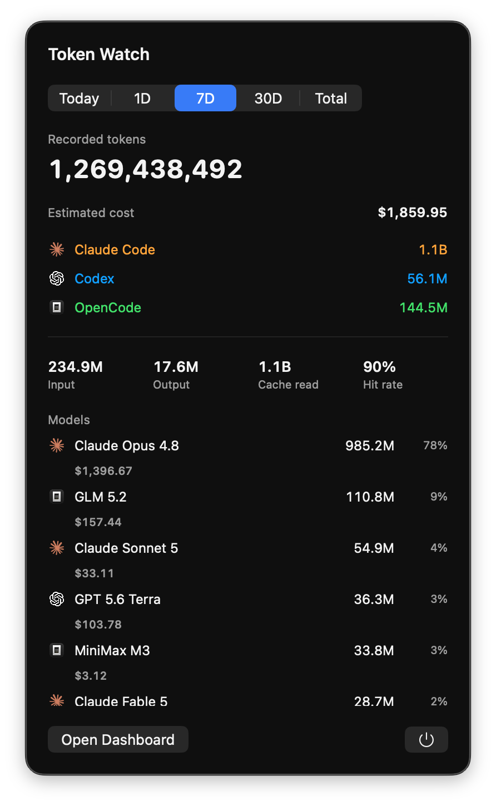

# Token Watch

A macOS 26+ SwiftUI menu-bar app that shows token-usage metadata already recorded locally by Claude Code, Codex, and OpenCode — no network, no sign-in, no data leaving your machine.

<p align="center">
  
</p>

## What it does

Token Watch reads the transcript files that Claude Code, Codex, and OpenCode already write to your home directory and surfaces token counts, session counts, and an illustrative cost estimate in a menu-bar popover and a dashboard window.

- **Menu-bar label** — live compact token total and estimated cost at a glance.
- **Popover** — per-provider breakdown, per-model usage with share percentages, and estimated USD cost. Switch between Today, 1D, 7D, 30D, and Total ranges.
- **Dashboard window** — overview with metric cards (recorded tokens, estimated cost, sessions, cache-read share), an activity chart, and a per-provider split; a Models view for per-model detail; and an About view.
- **Live updates** — an `FSEventStream` per provider directory re-scans on transcript changes, so numbers stay current without a refresh button.
- **Estimated cost** — a static, hand-maintained catalog of published API rates (`docs/pricing.md`) multiplies against observed token totals. It's an illustration, not an invoice: batch, peak, fast-mode, data-residency, and write-premium pricing are not modeled. Models without a catalog entry are flagged in the UI rather than silently counted as $0.

## Supported providers

| Provider | Source | Location |
|----------|--------|----------|
| Claude Code | JSONL transcripts | `~/.claude/projects/**/*.jsonl` |
| Codex | JSONL transcripts | `~/.codex/sessions/**/*.jsonl` |
| OpenCode | SQLite DB | `~/.local/share/opencode/opencode.db` |

## Privacy

This is the core of the product.

- **No networking, ever.** The app declares no network entitlement and ships a privacy audit (`script/audit_privacy.sh`) that rejects networking APIs (`URLSession`, `URLRequest`, `NWConnection`, etc.) on build.
- **Read-only.** Transcripts are decoded field-by-field — only whitelisted timestamp, model, and token-usage fields are read. Prompts, model responses, source code, paths, real session IDs, credentials, and account data are never read, displayed, or persisted.
- **No provider affiliation.** Token Watch is not affiliated with or endorsed by any provider. Token totals and cost estimates are local transcript metadata, not an official quota, invoice, or account balance.

## Requirements

- macOS 26.0 or later
- Swift 6.0 / Xcode 17+
- Claude Code, Codex, and/or OpenCode installed (at least one for data to appear)

## Build and test

```sh
# Privacy audit — must pass before any build
./script/audit_privacy.sh

# Build + launch + verify the app is running
./script/build_and_run.sh --verify

# Full test suite
xcodebuild -project TokenWatch.xcodeproj -scheme TokenWatch -configuration Debug \
  -derivedDataPath build/DerivedData CODE_SIGNING_ALLOWED=NO \
  -destination 'platform=macOS,arch=arm64' test
```

The app target ships unsigned Debug with no App Sandbox and no network entitlement. Select a signing team only when distributing a bundle.

## License

See [LICENSE](LICENSE).